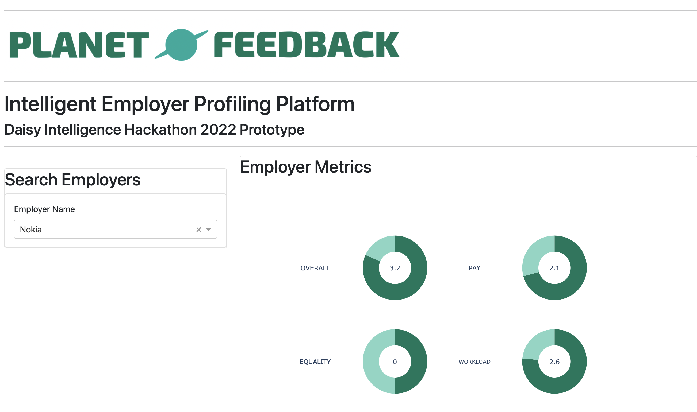

# Intelligent Employer Profiling Platform
#### **Copyright © 2022 Harvey Ronan Donnelly and Ewan Robert Jordan.**

## Setup Instructions

### Generating Model Data

1. Ensure that **Python 3.9+** and **pip** is installed.
2. Install project dependencies:

```pip install -r REQUIREMENTS.txt```

3. Execute **run.py** to generate employer profile models:

```python3 run.py```

Please note, this task may take up to 50 minutes to complete. The newly-generated models will be outputted to the
project directory as **output.json**. If you wish to use the newly-generated models with the visual interface, please
replace the existing pregenerated **output.json** in the **data** directory with the newly-generated file.

Alternatively, the pregenerated **output.json** file may be used for the visual interface instead of executing **
run.py**.

4. Run the visual interface:

```python3 interface.py```

This will be hosted locally on port 8888 by default. Visit `http://127.0.0.1:8888` and the following interface should be
available:


#### **Copyright © 2022 Harvey Ronan Donnelly and Ewan Robert Jordan.**
